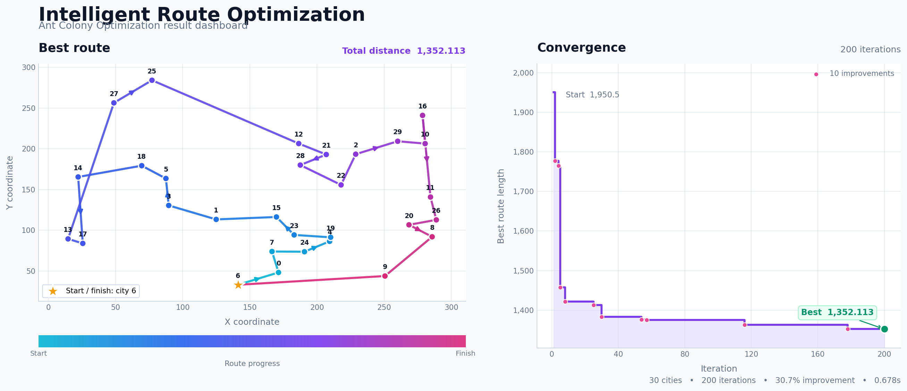

# Intelligent Route Optimization

Intelligent Route Optimization solves coordinate-based Traveling Salesman
Problem (TSP) instances with Ant Colony Optimization (ACO). It searches for a
short circular route that visits every city exactly once and returns to the
starting city.

The application supports Python 3.10+, reproducible experiments, input
validation, automated tests, command-line configuration, and a professional
result dashboard.

## Status

**Runnable and verified on Python 3.11.**

Default 30-city result with seed `42`:

```text
Cities: 30
Ants: 24
Iterations: 200
Best tour length: 1352.113190
```

ACO is stochastic, so changing the seed can produce a different valid route.

## Features

- Ant Colony Optimization for coordinate-based TSP datasets
- Linear pheromone evaporation and route-quality-based deposits
- Configurable dataset, ant count, iterations, seed, and output path
- Reproducible results with a deterministic random seed
- Validation for malformed and duplicate coordinates
- Terminal output with runtime, route length, and visit order
- Portfolio-ready route and convergence dashboard
- Automated tests using Python's standard `unittest` framework
- TensorFlow-free main application

## Project structure

```text
Intelligent-Route-Optimization/
|-- intelligent_route_optimization/       # Main application package
|   |-- __init__.py                       # Public package interface
|   |-- __main__.py                       # `python -m` entry point
|   |-- ant_colony.py                     # Ant Colony algorithm and configuration
|   |-- solver.py                         # Command-line orchestration
|   `-- visualization.py                  # Result dashboard design
|
|-- data/                                 # Input TSP datasets
|   |-- cities_30.txt                     # Small example: 30 cities
|   |-- cities_100.txt                    # Medium example: 100 cities
|   `-- cities_500.txt                    # Large example: 500 cities
|
|-- results/
|   `-- route_optimization_result.png     # Generated result dashboard
|
|-- tests/
|   `-- test_solver.py                    # Solver and dataset tests
|
|-- experiments/                          # Additional optimization approaches
|   |-- manufacturing_ipps/               # Manufacturing scheduling models
|   |-- classic_aco/                      # Standalone ACO variants
|   |-- hybrid_aco_rl/                    # ACO and learning combinations
|   |-- neural_network/                   # Neural-network route experiments
|   |-- reinforcement_learning/           # Q-learning, DQN, and A3C experiments
|   `-- ORIGINAL_README.md                # Reference documentation
|
|-- pyproject.toml                        # Package metadata and CLI entry point
|-- requirements.txt                     # Runtime dependency list
`-- README.md                             # Project documentation
```

## How the algorithm works

Each artificial ant starts from a random city and constructs a complete route.
The next-city probability combines:

1. **Pheromone strength:** successful edges become more attractive.
2. **Distance heuristic:** shorter edges receive a higher selection weight.

After each iteration, pheromones evaporate. Ants then deposit pheromone on the
edges they used, with shorter routes depositing more. The solver remembers the
best route found across every ant and iteration.

## Requirements

- Python 3.10 or newer
- Matplotlib 3.8 or newer

Install dependencies from the project root:

```powershell
python -m pip install -r requirements.txt
```

## Quick start

```powershell
python -m intelligent_route_optimization
```

The result is printed in the terminal and saved to:

```text
results/route_optimization_result.png
```

Open the dashboard window after saving it:

```powershell
python -m intelligent_route_optimization --show
```

## Custom experiment

```powershell
python -m intelligent_route_optimization `
  --data data/cities_100.txt `
  --iterations 300 `
  --ants 40 `
  --seed 7
```

For the 500-city dataset, begin with a smaller experiment:

```powershell
python -m intelligent_route_optimization `
  --data data/cities_500.txt `
  --iterations 30 `
  --ants 40
```

## Command-line options

| Option | Meaning | Default |
|---|---|---|
| `--data PATH` | Coordinate dataset | `data/cities_30.txt` |
| `--iterations N` | Optimization rounds | `200` |
| `--ants N` | Ants used per iteration | 80% of city count |
| `--seed N` | Reproducible random seed | `42` |
| `--output PATH` | PNG destination | `results/route_optimization_result.png` |
| `--show` | Open dashboard after saving | Disabled |
| `-h`, `--help` | Show CLI help | — |

## Dataset format

Each non-empty line contains one city as an `x,y` coordinate pair:

```text
12.5,8.0
23.1,17.4
8.7,31.2
```

The loader requires at least two cities, numeric values, and no duplicate
coordinates. Route lengths use Euclidean distance.

## Understanding the dashboard

The left panel displays:

- The best circular route
- City indexes
- Start and finish marker
- Direction arrows
- Route progress colors
- Total route distance

The right panel displays:

- Best-known distance per iteration
- Every improvement point
- Starting and final values
- Total improvement percentage
- Runtime and experiment summary



For the same dataset, a smaller route length represents a better solution.

## Run the tests

```powershell
python -m unittest discover -s tests -v
```

The tests verify dataset loading, complete route construction, and a
non-increasing best-length history.

## Use as a Python package

```python
from pathlib import Path

from intelligent_route_optimization import LinearPheromoneACO, load_cities

cities = load_cities(Path("data/cities_30.txt"))
solver = LinearPheromoneACO(cities, ant_count=24, seed=42)
solution = solver.solve(iterations=200)

print(solution.length)
print(solution.tour)
```

Optional editable installation:

```powershell
python -m pip install -e .
intelligent-route --help
```

## Additional experiments

The `experiments/` directory contains manufacturing scheduling, standalone
ACO, neural-network, reinforcement-learning, and hybrid ACO + TensorFlow
approaches. They are independent from the main application. Some experimental
modules require TensorFlow 1.x or Keras; the main solver only needs Matplotlib.

## Future improvements

- Add local-search strategies such as 2-opt
- Compare ACO with genetic and greedy baselines
- Export experiment metrics as JSON or CSV
- Add parameter benchmarking across all datasets
- Integrate selected learning approaches as separate modules
